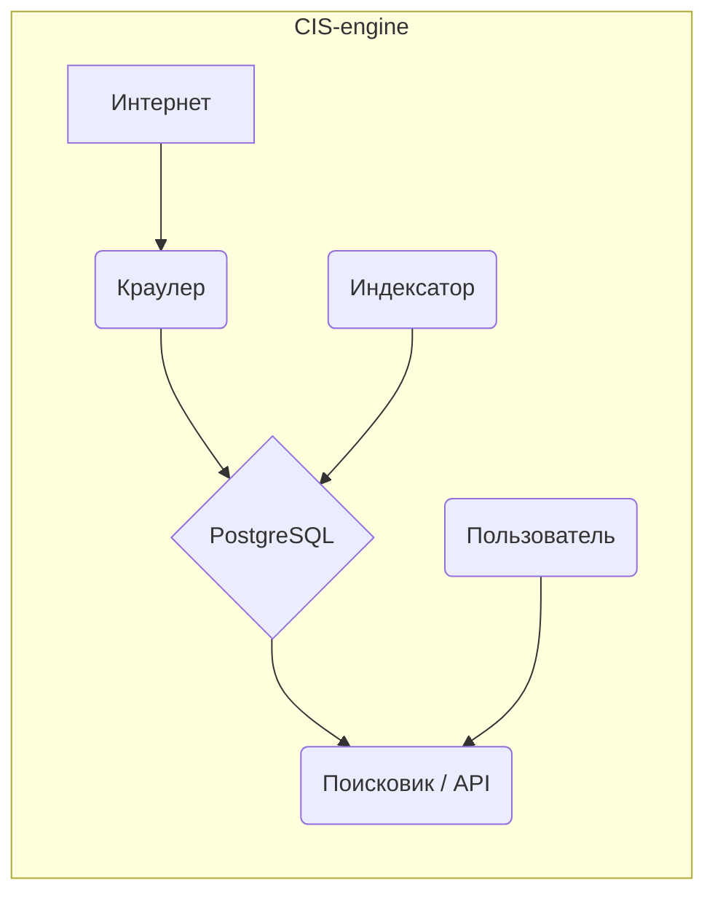

# CIS-engine
Высокопроизводительный поисковой движок на Go, созданный для демонстрации навыков системного проектирования и конкурентного программирования.


## Что это?
**CIS-engine** (Crawler-Indexer-Searcher) — это полноценный конвейер данных для сбора, индексации и поиска информации в вебе. Проект состоит из трех независимых компонентов:
* **Краулер (Crawler):** Эффективно обходит веб-страницы, извлекает контент и ссылки.
* **Индексатор (Indexer):** Анализирует сохраненные страницы и строит полнотекстовый поисковый индекс.
* **Поисковик (Searcher):** Предоставляет REST API для выполнения поисковых запросов.

## Архитектура
Компоненты системы слабо связаны и взаимодействуют через общую базу данных PostgreSQL, что обеспечивает модульность и масштабируемость.



## Функциональность
-   **Конкурентный краулер:** Использует пул воркеров для параллельной загрузки страниц.
-   **Ограничение скорости:** "Вежливый" обход сайтов с уважением к их ресурсам.
-   **Полнотекстовый поиск:** Использует встроенные возможности PostgreSQL (`tsvector`, `tsquery`) для релевантного и быстрого поиска на русском языке.
-   **REST API:** Простой и понятный API на базе Gin для поиска и управления.
-   **CLI-клиент:** Удобный инструмент (`cis-cli`) для взаимодействия с API из командной строки.
-   **Контейнеризация:** Готовые конфигурации Docker и Docker Compose для легкого локального развертывания.
-   **Автоматические релизы:** CI/CD пайплайн на GitHub Actions для сборки и публикации релизов под Windows, macOS и Linux с помощью GoReleaser.

## Технологический стек
-   **Язык:** Go
-   **Веб-фреймворк:** Gin Gonic
-   **База данных:** PostgreSQL
-   **CLI:** Cobra
-   **Контейнеризация:** Docker, Docker Compose
-   **CI/CD:** GitHub Actions, GoReleaser

## Начало работы
Для запуска проекта локально вам понадобится Docker и Docker Compose.

1.  **Клонируйте репозиторий:**
    ```bash
    git clone [https://github.com/Cuga77/CIS-engine.git](https://github.com/Cuga77/CIS-engine.git)
    cd CIS-engine
    ```

2.  **Запустите сервисы:**
    Эта команда поднимет API, краулер, индексатор и базу данных.
    ```bash
    docker-compose up --build
    ```
    API будет доступен по адресу `http://localhost:8081`.

## Использование CLI
После запуска системы вы можете взаимодействовать с ней через `cis-cli`.

1.  **Соберите CLI:**
    ```bash
    go build -o cis-cli ./cmd/cli/
    ```

2.  **Примеры команд:**
    ```bash
    # Добавить URL для сканирования
    ./cis-cli crawl "[https://go.dev/](https://go.dev/)"

    # Выполнить поиск
    ./cis-cli search "concurrency patterns"

    # Проверить статус системы
    ./cis-cli status

    # Показать версию CLI
    ./cis-cli version
    ```

## Документация API

| Метод | Эндпоинт            | Описание                                  | Тело запроса (Пример)         | Ответ (Пример)                                    |
|-------|---------------------|-------------------------------------------|-------------------------------|---------------------------------------------------|
| `POST`  | `/api/v1/crawl`     | Добавить URL в очередь на сканирование.   | `{"url": "https://gin-gonic.com"}` | `{"message":"URL принят..."}`                     |
| `GET`   | `/api/v1/search`    | Выполнить поиск по индексу.               | (query param `q=...`)         | `{"query": "go", "results": [{"url": "...", "title": "..."}]}` |
| `GET`   | `/api/v1/status`    | Получить статистику системы.              | -                             | `{"pages_count": 123}`                            |
