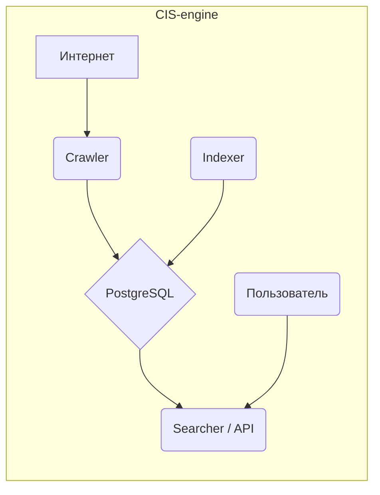

# CIS-engine
Высокопроизводительный поисковой движок на Go, созданный для демонстрации навыков системного проектирования и конкурентного программирования.


## О проекте
**CIS-engine** (Crawler-Indexer-Searcher) — это полноценный поисковый движок, реализованный на Go. Проект представляет собой полный конвейер данных: от сбора информации в вебе до предоставления удобного API для ее поиска.


*(Здесь будет GIF-анимация, показывающая работу `cis-cli`)*

## Архитектура
Система состоит из трех слабосвязанных компонентов, которые взаимодействуют через общую базу данных PostgreSQL. Такая архитектура обеспечивает модульность, отказоустойчивость и возможность независимого масштабирования каждого сервиса.



## Ключевые возможности
-   **🚀 Высокопроизводительный краулер:** Использует пул воркеров для эффективного конкурентного обхода сайтов.
-   **🔎 Полнотекстовый поиск:** Применяет встроенные возможности PostgreSQL (`tsvector`, `tsquery`) для быстрого и релевантного поиска с поддержкой русского языка.
-   **REST API:** Простой и понятный API на базе Gin для поиска и управления системой.
-   **CLI:** Удобный клиент командной строки (`cis-cli`) на базе Cobra для взаимодействия с API.
-   **🐳 Контейнеризация:** Готовые конфигурации Docker и Docker Compose для быстрого запуска всего стека одной командой.
-   **CI/CD:** Автоматизированные сборка, тестирование и публикация релизов под Windows, macOS и Linux с помощью GitHub Actions и GoReleaser.

## Технологический стек
-   **Язык:** Go
-   **Веб-фреймворк:** Gin Gonic
-   **База данных:** PostgreSQL
-   **CLI:** Cobra
-   **Контейнеризация:** Docker, Docker Compose
-   **CI/CD:** GitHub Actions, GoReleaser

## Начало работы
Для запуска проекта локально вам понадобится установленный Docker и Docker Compose.

1.  **Клонируйте репозиторий:**
    ```bash
    git clone [https://github.com/Cuga77/CIS-engine.git](https://github.com/Cuga77/CIS-engine.git)
    cd CIS-engine
    ```

2.  **Запустите сервисы:**
    Эта команда соберет образы и запустит API, краулер, индексатор и базу данных.
    ```bash
    docker-compose up --build
    ```
    После запуска API будет доступен по адресу `http://localhost:8081`.

## Использование CLI
Вы можете скачать готовый бинарный файл для вашей ОС со страницы [Releases](https://github.com/Cuga77/CIS-engine/releases) или собрать его из исходного кода:
```bash
go build -o cis-cli ./cmd/cli/
```

**Примеры команд:**
```bash
# Добавить URL для сканирования
./cis-cli crawl "[https://go.dev/](https://go.dev/)"

# Выполнить поиск по проиндексированным страницам
./cis-cli search "concurrency patterns"

# Проверить статус системы (количество страниц в индексе)
./cis-cli status

# Показать версию CLI
./cis-cli version
```

## Планы на будущее (Roadmap)
-   [ ] Реализация алгоритма PageRank для улучшения релевантности поиска.
-   [ ] Создание простого веб-интерфейса для поиска.
-   [ ] Переход на распределенную очередь задач (например, NATS или Redis) для масштабирования краулера.
-   [ ] Уважение правил `robots.txt` при сканировании.

## Вклад в проект
Предложения по улучшению и пул-реквесты приветствуются! Если вы нашли ошибку или хотите предложить новую функциональность, пожалуйста, создайте [Issue](https://github.com/Cuga77/CIS-engine/issues).

## Лицензия
Этот проект распространяется под лицензией MIT. Подробности смотрите в файле `LICENSE`.
